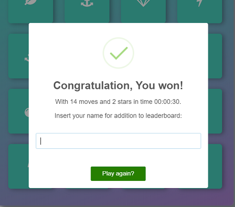

# Memory Game
Memory game is a game built using HTML, CSS, and JavaScript. The goal of the game is find two cards with same symbol in as few moves as possible.

## Game Description
The game board consists of sixteen "cards" arranged in a grid. The deck is made up of eight different pairs of cards, each with different symbols on one side. The cards are arranged randomly on the grid with the symbol face down. The gameplay rules are very simple: Flip over two hidden cards at a time to locate the ones that match.

The game displays:
* Star rating (from 1-3) that reflects the player's performance,
* current number of moves a player has made,
* time from the beginning of the game.

A restart button allows the player to reset the game board, the timer, and the star rating.

## Screenshots




## Quickstart
Clone from GIT repository.
```
$ git clone https://github.com/PeMajer/Project-5---Memory-game.git
```
Open `index.html` in your browser.

## Game Rules
Each turn:
* The player flips one card over to reveal its underlying symbol.
* The player then turns over a second card, trying to find the corresponding card with the same symbol.
* If the cards match, both cards stay flipped over.
* If the cards do not match, both cards are flipped face down.
* The game ends once all cards have been correctly matched.

## Star Rating
That reflects the player's performance.

★★★ - until 12 moves

★★☆ - until 15 moves

★☆☆ - over 15 moves

## Leaderboard
If you win game, you can save game stats to the leaderboard. Leaderboard stores game state using local storage.


## External
Use [Sweet Alert 2](https://github.com/limonte/sweetalert2) to create congratulations popup window when win a game.

## Contributing
* Fork the repository.
* Create a branch for the work you’re going to do.
* Make your changes in your branch.
* Send a pull request from your branch to this repository.

## License
It is free software, and may be redistributed under the terms specified in the [license file](LICENSE.md).

